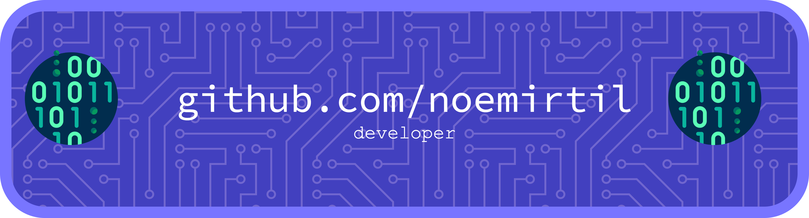

# Hello world, I'm Noemí 👩🏻‍💻
### Let's talk in english, spanish, catalan, or french.
### 🫐 🌱 🫐 🌱 🫐 🌱 🫐 🌱 🫐 🌱 🫐 

- 💾 DEVELOPING WITH 💜:
	- **PostgreSQL**
	- **Python**
	- **Shell**
	- JavaScript + CSS + HTML
	- Swift
- 📚  Graduated in **Python** & **SQL** with [**Harvard**'s CS50](https://pll.harvard.edu/course/cs50s-introduction-programming-python)
- 👩🏻‍🎓  **Grau superior** FP de Nivell 3: IFCD0210 **DAW** Barcelona Activa
	- [Desenvolupament d'Aplicacions Web Servei d'Ocupació de Catalunya](https://sede.sepe.gob.es/especialidadesformativas/RXBuscadorEFRED/DetalleEspecialidad.do?metodo=modulada&codEspecialidad=IFCD0210&volver=true&idBusquedaFormacion=&volverUrl=)
- ✉️ How to reach me: 
	- **[🫐 LinkedIn](https://www.linkedin.com/in/noemie-baudouin/)**
	- **[🫐 email](noemirtil@gmail.com)**
- 🫐 Pronouns: she, her
- ⏭️ Coming from audio engineering in Paris to programming in Barcelona